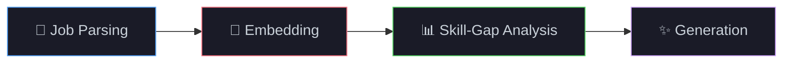

<!-- Dynamic Header Banner -->


<!-- Typing Animation -->
<p align="center">
  <a href="https://git.io/typing-svg">
    
  </a>
</p>

<!-- Social Badges -->
<p align="center">
  <a href="https://www.linkedin.com/in/sri-akash-kadali">
    
  </a>
  <a href="mailto:srikadaliakash@gmail.com">
    
  </a>
  <a href="https://www.srikadali.com">
    
  </a>
  
</p>

---

##  About Me

```yaml
name: Sri Akash Kadali
role: Software Engineer | AI/ML Systems | Full Stack
location: College Park, MD
education:
  - MS in Applied Machine Learning @ University of Maryland, College Park (2026)
  - B.Tech in Computer Science @ IIIT Vadodara (2024)

specializations:
  - End-to-end system design (API → Distributed Systems → ML Pipelines → UI)
  - LLM-powered applications & AI systems
  - High-performance ML & systems optimization (CUDA, inference tuning)

differentiators:
  - I don't just train models — I ship complete systems
  - I optimize for latency, scalability, and production reliability
  - I bridge systems engineering + machine learning
```

---

##  Tech Stack

<p align="center">
  <b>Languages</b>
  <br/><br/>
  <a href="https://skillicons.dev">
    
  </a>
  <br/>
  
  
</p>

<p align="center">
  <b>AI / ML / LLM Systems</b>
  <br/><br/>
  <a href="https://skillicons.dev">
    
  </a>
  <br/>
  
  
  
  
  
  
  <br/>
  
  
  
  
  
  
</p>

<p align="center">
  <b>Backend & Systems Engineering</b>
  <br/><br/>
  <a href="https://skillicons.dev">
    
  </a>
  <br/>
  
  
  
  
  <br/>
  
  
  
  
</p>

<p align="center">
  <b>Systems ML & Optimization</b>
  <br/><br/>
  
  
  
  
  <br/><br/>
  
  
  
  
  
</p>

<p align="center">
  <b>Cloud, DevOps & MLOps</b>
  <br/><br/>
  <a href="https://skillicons.dev">
    
  </a>
  <br/>
  
  
  
  
  
</p>

<p align="center">
  <b>Data Engineering & Pipelines</b>
  <br/><br/>
  
  
  
  
  <br/>
  
  
  
  
</p>

<p align="center">
  <b>Frontend Engineering</b>
  <br/><br/>
  <a href="https://skillicons.dev">
    
  </a>
</p>

---

## 💼 Experience

<table>
  <tr>
    <td width="100" align="center">
      
      <br/><b>Ayar Labs</b>
    </td>
    <td>
      <b>Machine Learning Engineering Intern</b> · <code>Santa Clara, CA | Summer 2025</code>
      <br/><br/>
      ▸ Built <b>high-performance ML pipelines</b> for hardware-aware optimization<br/>
      ▸ Improved inference efficiency via <b>model compression & profiling</b><br/>
      ▸ Worked close to systems layer optimizing <b>compute + memory bottlenecks</b>
    </td>
  </tr>
  <tr>
    <td width="100" align="center">
      
      <br/><b>IIT Indore</b>
    </td>
    <td>
      <b>Software Engineer (ML/AI) Intern</b> · <code>2022 – 2024</code>
      <br/><br/>
      ▸ Designed <b>end-to-end ML systems</b> from data ingestion → training → deployment<br/>
      ▸ Built scalable pipelines handling <b>large structured + unstructured datasets</b><br/>
      ▸ Improved model performance using <b>feature engineering + hyperparameter tuning</b>
    </td>
  </tr>
  <tr>
    <td width="100" align="center">
      
      <br/><b>NIT Jaipur</b>
    </td>
    <td>
      <b>Software Engineer (ML/AI) Intern</b> · <code>2024</code>
      <br/><br/>
      ▸ Developed applied ML solutions across <b>real-world datasets</b><br/>
      ▸ Focused on <b>model generalization + deployment readiness</b>
    </td>
  </tr>
</table>

---

## 🌌 Flagship Project

<a href="https://github.com/Akash-Kadali/ASTRA">
  
</a>

### 🔗 [ASTRA — AI Career Automation Platform](https://github.com/Akash-Kadali/ASTRA)

A **full-stack AI system** that automates resume optimization, job alignment, and content generation.



<table>
<tr>
<td width="50%">

**⚡ Architecture**
| Layer | Stack |
|---|---|
| **Backend** | FastAPI, async services, modular arch |
| **Frontend** | PyWebView + reactive UI |
| **AI Layer** | LLM reasoning, scoring pipelines |
| **Infra** | Local-first + optimized inference |

</td>
<td width="50%">

**📈 Impact**
- Reduced manual resume tailoring by **>80%**
- Designed **scalable AI pipeline architecture**
- Built with **production-first mindset**

</td>
</tr>
</table>

---

## 🧩 Engineering Strengths

<p align="center">
  
  
  
  
</p>

---

## 🏆 Highlights

<p align="center">
  
  
  
  <br/>
  
  
</p>

---

## 📊 GitHub Analytics

<p align="center">
  <a href="https://github.com/Akash-Kadali">
    
    &nbsp;&nbsp;
    
  </a>
</p>

<p align="center">
  <a href="https://github.com/Akash-Kadali">
    
  </a>
</p>

<p align="center">
  <a href="https://github.com/Akash-Kadali">
    
  </a>
</p>

<!-- Activity Graph -->
<p align="center">
  <a href="https://github.com/Akash-Kadali">
    
  </a>
</p>

---

## 🎯 Open To

<p align="center">
  
  
  
  
</p>

---

## 📫 Let's Connect

<p align="center">
  <a href="mailto:srikadaliakash@gmail.com">
    
  </a>
  <a href="https://srikadali.com">
    
  </a>
  <a href="https://www.linkedin.com/in/sri-akash-kadali">
    
  </a>
</p>

<br/>

<p align="center">
  <b><i>「 Build systems. Optimize performance. Ship real-world AI. 」</i></b>
</p>

<!-- Dynamic Footer Banner -->

